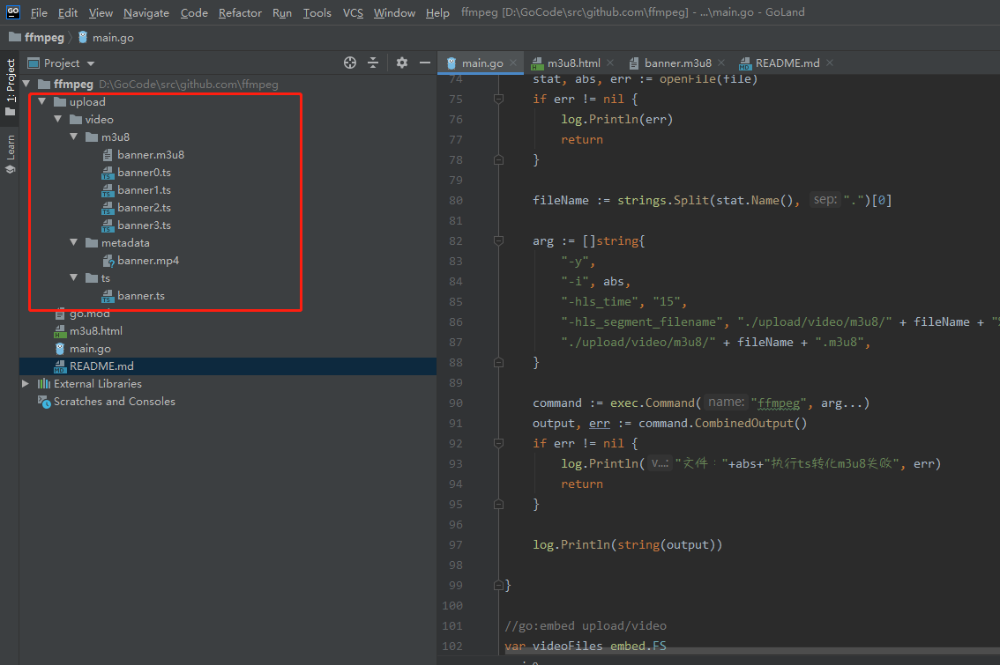
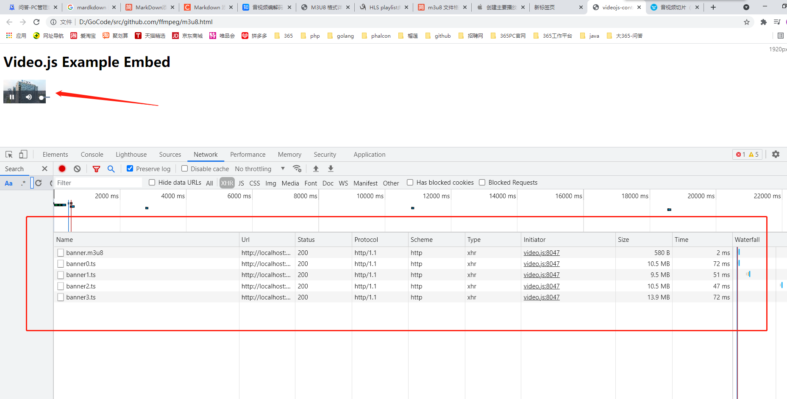

# 如何实现一个视频播放功能？

该项目的目标是：用户上传mp4文件，程序将mp4文件转化成m3u8文件和.ts的视频文件，客户端可以通过访问m3u8这个文件，从而播放整个视频

项目中banner.mp4文件太大了，关于视频文件都没有纳入版本库，可自己弄mp4视频上去，然后调用main.go里面的函数生成banner.ts文件和m3u8文件


关于视频到底是怎么播放的？给了一个链接之后，播放器为什么能播放这件事情，可以自己看这个视频了解下 ！[直播平台技术原理浅析](https://www.bilibili.com/video/BV1dv411C7vx?t=3428)

总之就是给的链接是一个流：流里面每一个数据传的是mp4、avi等封装格式的数据，而每个封装格式的数据里面有更具体的数据格式，叫做“码流”，可以区分到底是图片、还是音频。。。


# 技术梳理

- m3u8文件
- HLS协议

## m3u8简介

m3u8，是HTTP Live Streaming直播的索引文件。m3u8基本上可以认为就是.m3u格式文件，区别在于，m3u8文件使用UTF-8字符编码。M3U8主要是可以做多码率的适配，根据网络带宽，客户端会选择一个适合自己码率的文件进行播放，保证视频流的流畅。在IOS device和mac上可以用http的方式进行分发，其中playlist标准为由m3u扩展而来的m3u8文件，媒体文件为MPEG2-TS或者AAC文件(audio only)。

m3u8文件有两种应用场景：多码率适配流和单码率适配流。


## HLS协议简介

HLS(HTTPLiveStreaming)是苹果公司针对iPhone、iPod、iTouch和iPad等移动设备而开发的基于HTTP协议的流媒体解决方案。在HLS技术中Web服务器向客户端提供接近实时的音视频流。但在使用的过程中是使用的标准的HTTP协议，所以这时，只要使用HLS的技术，就能在普通的HTTP的应用上直接提供点播和直播。在AppStore中的视频相关的应用，基本都是应用的此种技术。该技术基本原理是将视频文件或视频流切分成小片(ts)并建立索引文件(m3u8)。支持的视频流编码为H.264，音频流编码为AAC。


## m3u8和HLS协议一些参考文献和应用


### 关于m3u8一些应用操作与高级应用

- [1] [palylist文件经典demo](https://www.cnblogs.com/tocy/p/hls-playlist-example.html)
- [2] [M3U8 #EXT-X-KEY和HLS协议实现视频文件鉴权](https://www.cnblogs.com/tocy/p/hls-playlist-example.html)
- [3] [M3U8 #EXT-X-KEY和HLS协议实现视频文件鉴权](https://developer.qiniu.com/dora/1485/audio-and-video-slice)
- [4] [M3U8 #EXT-X-DISCONTINUITY 内嵌广告入视频](https://www.cnblogs.com/tocy/p/hls-playlist-example.html)
- [5] [M3U8 #EXT-X-MEDIA-SEQUENCE 切换视频播放顺序](https://www.cnblogs.com/tocy/p/hls-playlist-example.html)
- [6] [M3U8文件，playlis播放列表格式和Master Playlist格式，多码率适配流和单码率适配流、播放媒体适配](https://www.jianshu.com/p/e97f6555a070)


# demo正式开始

技术栈和概念
- ffmpeg 开源工具，（用该工具生成m3u8文件和.ts视频文件）
- golang 语言

目录结构:
```

|-- main.go 服务器入口
|-- upload 上传文件
    |-- video 视频文件
        |-- m3u8 存放生成的m3u8文件和.ts视频文件
        |-- metadata mp4文件(用户上传的mp4文件)
        |-- ts 将用户的mp4文件，转化成一个大的.ts文件
```

如何所示：



## m3u8文件和小块的.ts视频文件生成过程

### 1. 将banner.mp4文件转化成banner.ts大文件，存放在ts文件夹


go代码方式： 可参考main.go的mp4ToTs()方法
```
//mp4文件转化到ts
//返回ts文件的路径
func mp4ToTs(file string) string {
	stat, abs, err := openFile(file)
	if err != nil {
		log.Println(err)
		return ""
	}

	fileName := "./upload/video/ts/" + strings.Split(stat.Name(), ".")[0] + ".ts"

	//ffmpeg mp4 to ts文件
	arg := []string{
		"-y",
		"-i", abs,
		"-vcodec", "copy",
		"-acodec", "copy",
		"-vbsf", "h264_mp4toannexb",
		fileName,
	}
	command := exec.Command("ffmpeg", arg...)
	output, err := command.CombinedOutput()
	if err != nil {
		log.Println("文件："+abs+"执行mp4转化ts失败", err)
		return ""
	}

	log.Println(string(output))

	newFilePathAbs, _ := filepath.Abs(fileName)
	return newFilePathAbs
}
```

手动执行ffmpeg命令
```
ffmpeg -y -i banner.mp4 -vcodec copy -acodec copy -vbsf h264_mp4toannexb ../ts/banner.ts
```

问题：
1. 为什么要先将mp4转化成一个大的.ts文件？ 我不知道！网上是这么说的，先转化成大的ts文件不会失帧。（不知道是真还是假,有待研究）

### 2. 将banner.ts文件切分成小的.ts文件和生成.m3u8文件

go代码方式： 可参考main.go的tsToM3U8()方法
```

//ts文件转m3u8
func tsToM3U8(file string) {
	stat, abs, err := openFile(file)
	if err != nil {
		log.Println(err)
		return
	}

	fileName := strings.Split(stat.Name(), ".")[0]

	arg := []string{
		"-y",
		"-i", abs,
		"-hls_time", "15",
		"-hls_segment_filename", "./upload/video/m3u8/" + fileName + "%d.ts",
		"./upload/video/m3u8/" + fileName + ".m3u8",
	}

	command := exec.Command("ffmpeg", arg...)
	output, err := command.CombinedOutput()
	if err != nil {
		log.Println("文件："+abs+"执行ts转化m3u8失败", err)
		return
	}

	log.Println(string(output))

}

```

手动执行ffmpeg命令
```

#-hls_time 参数表示将视频按15s切分成一个小.ts文件
ffmpeg -y -i banner.ts -hls_time 15 -hls_segment_filename .ts文件的输出路径 .m3u8文件的输出路径

```

### 3. m3u8的文件和.ts分片视频已经完成，剩下的就是服务器编码问题了

我们先看一下生成的.m3u8文件长什么样子

```
#EXTM3U
#.m3u8的版本
#EXT-X-VERSION:3
#EXT-X-TARGETDURATION:17
#EXT-X-MEDIA-SEQUENCE:0
#EXTINF:15.200000,
banner0.ts
#EXTINF:15.880000,
banner1.ts
#EXTINF:15.160000,
banner2.ts
#EXTINF:17.240000,
banner3.ts
#EXT-X-ENDLIST
```

启动golang服务器(文件服务器)，访问m3u8文件播放视频


代码参考m3u8.html
```html

<video id="my_video_1" class="video-js vjs-default-skin" controls preload="auto" width="100%" height="auto"
       data-setup='{}'>
    <source src="http://localhost:8888/video/m3u8/banner.m3u8" type="application/x-mpegURL">
</video>

```

m3u8文件夹下的banner.m3u8文件和.ts文件放在同一个文件夹下，播放器会使用相对路径找到相应的.ts文件

如：

http://localhost:8888/video/m3u8/banner.m3u8

http://localhost:8888/video/m3u8/banner0.ts

http://localhost:8888/video/m3u8/banner1.ts

http://localhost:8888/video/m3u8/banner2.ts

http://localhost:8888/video/m3u8/banner3.ts


效果图： 




#### 4. 扩展功能

##### ffmpeg生成加密的视频分片


hls视频加密都是采用的是对称加密


将切分的命令换成这个

```

#hls_key_info_file 指定keyinfo文件
ffmpeg -y -i banner.ts -hls_time 15 -hls_segment_filename .ts文件的输出路径 .m3u8文件的输出路径

```

keyinfo文件内容格式如下

```
获取秘钥key的URI
秘钥key路径
IV,（可选）
```

keyinfo文件demo

```html
http://localhost/test/encrypt2.key
./encrypt2.key
88c674428c1e719751565ad00fe24243
```


hls启动加密后的m3u8文件

```html
#EXTM3U
#EXT-X-VERSION:3
#EXT-X-TARGETDURATION:17
#EXT-X-MEDIA-SEQUENCE:0
#获取解密信息，IV可以去掉，通过动态的URI去获取IV从而实现鉴权的效果
#EXT-X-KEY:METHOD=AES-128,URI="http://localhost/test/encrypt2.key",IV=0x88c674428c1e719751565ad00fe24243
#EXTINF:15.200000,
file0.ts
#EXTINF:15.880000,
file1.ts
#EXTINF:15.160000,
file2.ts
#EXTINF:17.240000,
file3.ts
#EXT-X-ENDLIST

```

参考:

- [1] [ffmpeg 生成加密的视频分片](http://www.cxyzjd.com/article/feifeilb/101175821)

##### m3u8视频内嵌广告

有时候我们需要在直播或点播中插入广告，广告的编码格式可能跟原来的编码格式不同，为了支持类似场景，HLS提供了***EXT-X-DISCONTINUITY***字段，用于通知客户端可能存在码流编码格式不连续。其对应的m3u8格式如下：


```html
#EXTM3U
#EXT-X-VERSION:3
#EXT-X-TARGETDURATION:17
#EXT-X-MEDIA-SEQUENCE:0
#EXTINF:15.200000,
banner0.ts
#EXTINF:15.880000,
banner1.ts
#EXTINF:15.160000,
banner2.ts
#视频播放完banner2.ts之后内嵌一个广告
#EXT-X-DISCONTINUITY
#EXTINF:15.200000,
banner0.ts
#EXTINF:15.880000,
banner1.ts
#EXTINF:15.160000,
banner2.ts
#播放完广告之后继续播放视频
#EXTINF:17.240000,
banner3.ts
#EXT-X-ENDLIST

```


##### 直播playlist

对于直播playlist，其特征字段就是没有EXT-X-ENDLIST标签，并且不存在EXT-X-PLAYLIST-TYPE标签。
直播playlist是一个典型的滑动窗口，server端会对源格式做实时转码（存在一点延时），并定期清理已发布的分片信息。典型的滑动窗口大小为3-5个分片。其m3u8格式如下：


```
#EXTM3U
#EXT-X-TARGETDURATION:10
#EXT-X-VERSION:3
#EXT-X-MEDIA-SEQUENCE:1
#EXTINF:10,
fileSequence1.ts
#EXTINF:10,
fileSequence2.ts
#EXTINF:10,
fileSequence3.ts
```

对于任意一个分片URI被移除该playlist，必须更新EXT-X-MEDIA-SEQUENCE字段（+1即可）。移除URI必须按照顺序，并保证客户端通过滑动窗口拿到连续的分片信息。按照这样更新之后的playlist如下：

```
#EXTM3U
#EXT-X-TARGETDURATION:10
#EXT-X-VERSION:3
#EXT-X-MEDIA-SEQUENCE:2
#EXTINF:10,
fileSequence2.ts
#EXTINF:10,
fileSequence3.ts
#EXTINF:10,
fileSequence4.ts
#EXTINF:10,
```


